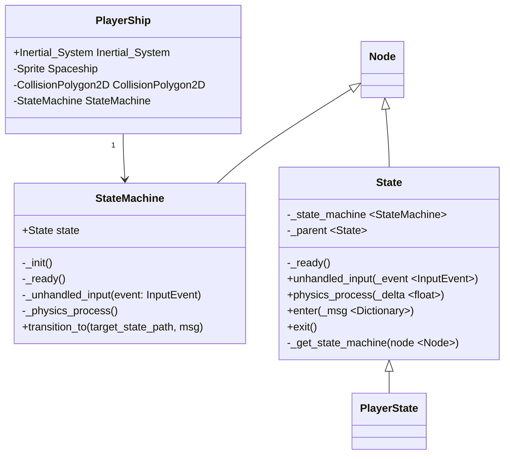
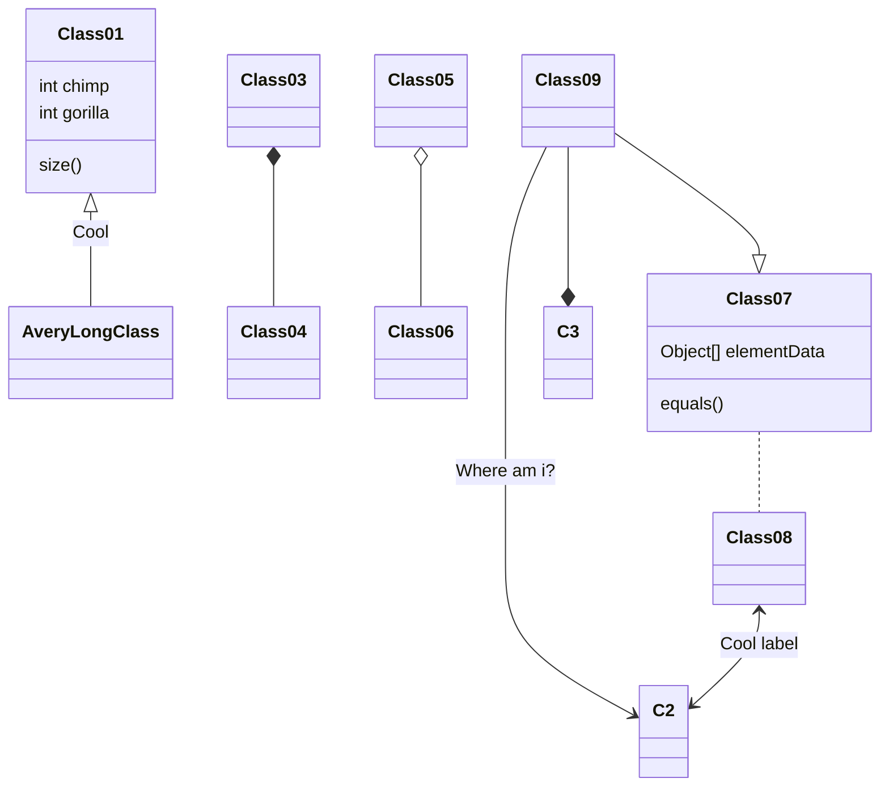

<!-- ```mermaid
classDiagram
class PlayerShip{
    +Inertial_System Inertial_System
    -Sprite Spaceship
    -CollisionPolygon2D CollisionPolygon2D 
    -StateMachine StateMachine
}

Node <|-- State 
Node <|-- StateMachine
State <|-- PlayerState


``` -->

